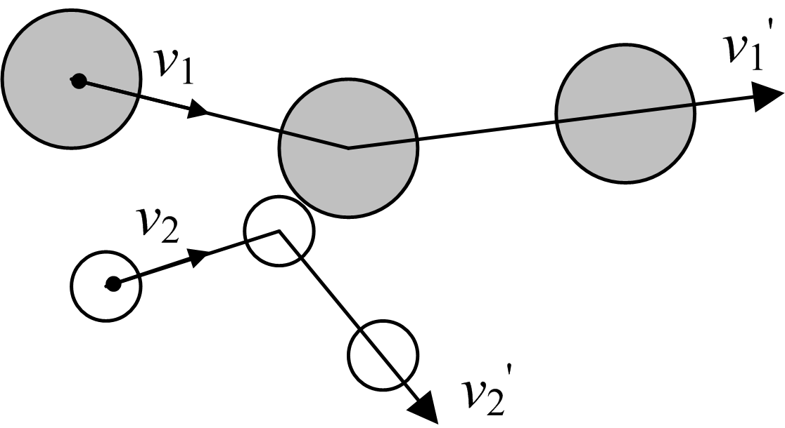
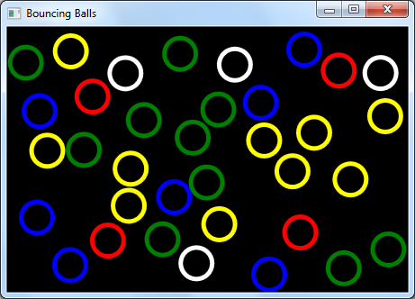

## Kollision von Kugeln

Zahlreiche Vorgänge aus unserem täglichen Umfeld unterliegen den Gesetzen der Natur. Wir betrachten in dieser Übung eine praktische Anwendung aus einer Teildisziplin der Physik, der Mechanik. Sowohl beim Zusammenstoß zweier Autos auf einer Kreuzung wie auch beim Aufeinanderprallen zweier Kugeln beim Billardspielen sind die so genannten „Stoßprozesse“ im Spiel, siehe Abbildung 1:

Abbildung 1. Der Zusammenstoß zweier Kugeln.

In Abbildung 1 erkennen wir den Zusammenstoß zweier Kugeln, die zunächst die Geschwindigkeitsvektoren v1 und v2 besitzen und sich nach dem Zusammenprall mit veränderten Geschwindigkeiten v1’ und v2’ weiterbewegen. In der nun folgenden Aufgabe entwerfen wir ein Programm, dass den Zusammenstoß einer beliebigen Anzahl von Kugeln in einer begrenzten rechteckigen Fläche auf der Grundlage der mechanischen Stoßgesetze simuliert, siehe Abbildung 2:

Abbildung 2. Anwendung mit kollidierenden Kugeln.

